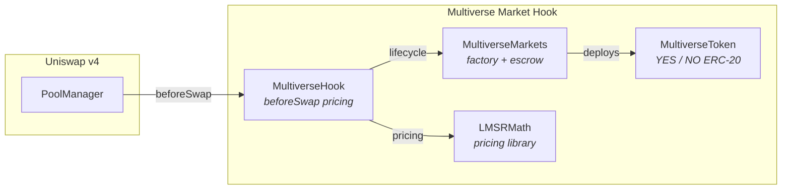
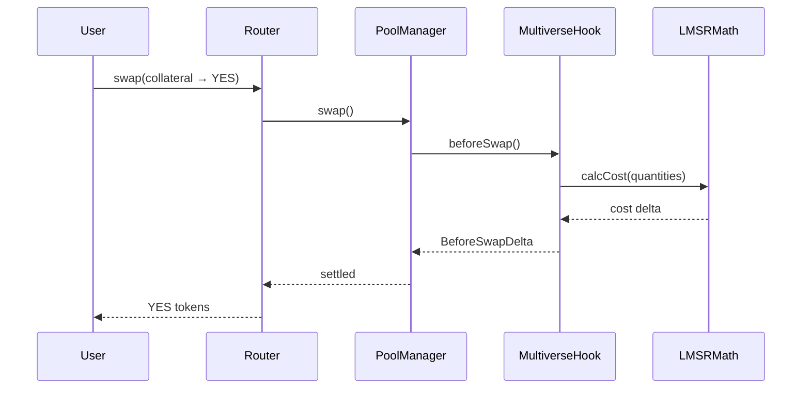

# Multiverse Market Hook

**Prediction markets as a Uniswap v4 hook** 🦄

[](https://soliditylang.org/)
[](https://book.getfoundry.sh/)
[](https://docs.uniswap.org/contracts/v4/overview)
[](LICENSE)

## Overview

Multiverse Market Hook brings **on-chain prediction markets** directly into Uniswap v4's swap flow. A single hook deployment supports unlimited binary markets, each priced by the **Logarithmic Market Scoring Rule (LMSR)** — the gold standard for automated market makers in prediction markets. Traders interact through standard Uniswap swaps: the hook intercepts `beforeSwap` to mint, price, and settle outcome tokens, making every market instantly compatible with existing routers and aggregators.

## Key Features

- **Single-deploy, unlimited markets** — one `MultiverseHook` instance manages all prediction markets
- **LMSR pricing with bounded loss** — market maker never loses more than the initial funding
- **Full lifecycle** — create → trade → resolve → redeem, all on-chain
- **Uniswap-native** — swaps route through standard v4 infrastructure (routers, aggregators, UI)
- **145 tests** + Python FFI cross-verification against a reference LMSR oracle
- **WAD fixed-point arithmetic** — precise pricing via `solady` math primitives

## How It Works

### Architecture



### Swap Flow



### Market Lifecycle

| Action | What happens |
|--------|-------------|
| **Create** | `createMarket(universeId, collateral, funding)` — deploys YES/NO tokens, seeds LMSR |
| **Split** | Deposit collateral → receive equal YES + NO tokens |
| **Trade** | Swap collateral ↔ YES/NO via Uniswap v4 pools (LMSR-priced) |
| **Merge** | Return equal YES + NO → reclaim collateral |
| **Resolve** | Oracle designates winning outcome |
| **Redeem** | Burn winning tokens → withdraw collateral |

## Deployment

Deployed on **Unichain Sepolia**:

| Contract | Address |
|----------|---------|
| `MultiverseMarkets` | `[0x06fb682A2C6B52e090D2b66621c05494FBb67083](https://sepolia.uniscan.xyz/address/0x06fb682A2C6B52e090D2b66621c05494FBb67083)` |
| `MultiverseHook` | `[0x021823d2B63455fbE66B08a34475Aae8A0ae4A88](https://sepolia.uniscan.xyz/address/0x021823d2B63455fbE66B08a34475Aae8A0ae4A88)` |

> [!NOTE]
> Contract addresses will be updated after deployment.

## Live Demo

**[multiverse.joydeeeep.com](https://multiverse.joydeeeep.com/)**

## Getting Started

```bash
# Clone & install
git clone https://github.com/<you>/multiverse-market-hook.git
cd multiverse-market-hook
forge install

# Run tests
forge test

# Run tests with Python FFI cross-verification
forge test --ffi

# Local development
anvil --code-size-limit 40000
forge script script/00_DeployHook.s.sol \
    --rpc-url http://localhost:8545 \
    --private-key <PRIVATE_KEY> \
    --broadcast
```

## Project Structure

```
src/
├── MultiverseHook.sol      # v4 hook — beforeSwap pricing + lifecycle
├── MultiverseMarkets.sol   # Factory + escrow for binary markets
├── MultiverseToken.sol     # YES/NO outcome ERC-20
├── LMSRMath.sol            # LMSR cost function + pricing
├── LMSRMathLOG2.sol        # Alternative LOG2-based implementation
├── IMarketHook.sol         # Hook interface
└── SimpleERC20.sol         # Collateral token for testing

test/
├── MultiverseHook.t.sol    # 23 hook integration tests
├── MultiverseMarkets.t.sol # 52 market lifecycle tests
├── LMSRMath.t.sol          # 54 unit tests for pricing math
├── LMSRMathFFI.t.sol       # 8 FFI tests vs Python reference oracle
└── utils/                  # Test harnesses + helpers

script/
├── lmsr_reference.py       # Python LMSR oracle for FFI verification
└── *.s.sol                 # Deploy, pool setup, and swap scripts
```

## Technical Details

### LMSR Pricing

The hook uses the **Logarithmic Market Scoring Rule** for pricing:

```
C(q) = b · ln(Σ exp(qᵢ / b))
```

Where `b = funding / ln(N)` and `N` is the number of outcomes. Prices are the softmax of outcome quantities — as demand for YES increases, its price rises toward 1 while NO falls toward 0.

### Fixed-Point Arithmetic

All math uses **WAD (1e18) fixed-point** via Solady's `FixedPointMathLib`. Token quantities are scaled from their native decimals (e.g., 6 for USDC) to WAD precision for intermediate calculations, then scaled back for settlement.

### Hook Permissions

```
beforeAddLiquidity    ✓  (blocks standard LP — LMSR is the sole market maker)
beforeRemoveLiquidity ✓  (blocks standard LP removal)
beforeSwap            ✓  (intercepts swaps for LMSR pricing)
beforeSwapReturnDelta ✓  (returns custom settlement amounts)
```

## Resources

- [Uniswap v4 Docs](https://docs.uniswap.org/contracts/v4/overview)
- [Multiverse Finance](https://www.paradigm.xyz/2025/05/multiverse-finance)
- [LMSR Paper — Hanson 2003](https://mason.gmu.edu/~rhanson/mktscore.pdf)
- [LMSR Desmos Calculator](https://www.desmos.com/calculator/bwczrpaoqk)
- [v4-by-example](https://v4-by-example.org)
